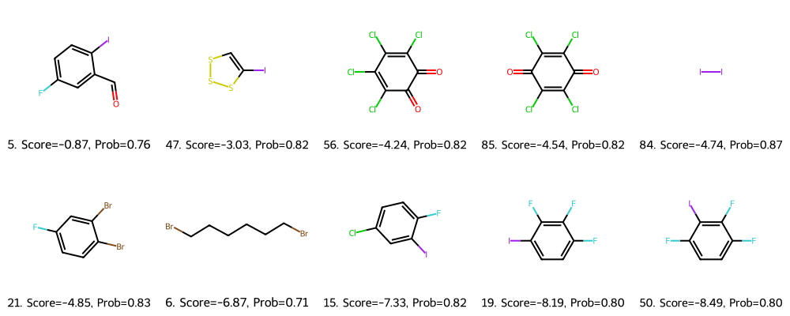

Ниже – файл в формате Markdown. Скопируй этот текст целиком в файл `README.md`, и в Obsidian (или любом другом Markdown-редакторе) сохранится структура со всеми заголовками и разметкой.


# Применение эволюционной оптимизации для дизайна сокристаллов с улучшенными свойствами таблетируемости

Этот репозиторий содержит набор Python-скриптов и данных для решения кейса: поиск и оптимизация коформеров для сокристаллов теофиллина, с упором на улучшение механических свойств (таблетируемость, стабильность, растворимость).

---

## 1. Установка окружения и запуск

### Шаг 1: Клонировать репозиторий
```bash
git clone https://github.com/username/crystal-optimization.git
cd crystal-optimization
```

### Шаг 2: Инициализация среды через uv (Python 3.8)
В данном проекте подразумевается использование утилиты uv и Python версии 3.8:
```bash
uv venv --python=3.8
uv pip install --upgrade pip
```

### Шаг 3: Установка необходимых библиотек
```bash
uv pip install -r pyproject.toml
```
(или по списку: `rdkit`, `pandas`, `numpy`, `scikit-learn`, `matplotlib`, `deap`, и т.д.)

---

## 2. Структура проекта

```text
.
├── analyze_coformers.py
├── analyze_final_coformers.py
├── checkpoints
│   ├── gbc_H-bonds bridging.pkl
│   ├── gbc_Orthogonal planes.pkl
│   ├── gbc_Unobstructed.pkl
│   ├── min_max_scaler.pkl
│   └── result_features
│       ├── features_H-bonds bridging.txt
│       ├── features_Orthogonal planes.txt
│       └── features_Unobstructed.txt
├── classifier.py
├── data
│   ├── database_CCDC.csv
│   ├── database_GAN.csv
│   ├── filtered_coformers.csv
│   ├── final_coformers.csv
│   ├── optimized_coformers.csv
│   ├── predicted_coformers.csv
│   └── top_10_coformers.csv
├── data_processing.py
├── filter_optimized_coformers.py
├── optimize_coformers.py
├── predict_properties.py
├── pyproject.toml
├── README.md
├── sources
│   ├── hist_MW_comparison.png
│   ├── top10_molecules.csv
│   └── top10_molecules.png
└── uv.lock
```

- **analyze_coformers.py / analyze_final_coformers.py**: скрипты для различных вариантов анализа и визуализации.
- **checkpoints/**: файлы обученных моделей (Gradient Boosting) и их вспомогательные дескрипторы.
- **classifier.py**: класс для предсказания механических свойств молекул.
- **data/**: все данные – исходные датасеты (CCDC, GAN), а также промежуточные и финальные результаты.
- **data_processing.py**: (Этап 1) очистка и фильтрация молекул (по MW, LogP, SA).
- **filter_optimized_coformers.py**: (подэтап 3.1) финальная проверка оптимизированных молекул.
- **optimize_coformers.py**: (Этап 3) эволюционная оптимизация (генетический алгоритм, BRICS-мутирование).
- **predict_properties.py**: (Этап 2) предсказание механических свойств (Unobstructed, OrthogonalPlanes, H-Bond).
- **pyproject.toml**: список зависимостей (pip/poetry).
- **sources/**: папка для результатов анализа (графики, top-10 молекул и т.п.).

---

## 3. Краткое описание решения

### Этап 1: Очистка и фильтрация (data_processing.py)
1. Загружаются файлы `database_CCDC.csv` и `database_GAN.csv`.
2. Удаляются дубликаты и проверяются валидные SMILES (RDKit).
3. Рассчитываются MW, LogP, SA.
4. Фильтрация по порогам (MW≤500, LogP≤5, SA≤3).
5. Сохранение в `filtered_coformers.csv`.

### Этап 2: Предсказание механических свойств (predict_properties.py)
1. Берём `filtered_coformers.csv`.
2. Генерируем дескрипторы (RDKit + drug SMILES).
3. Прогоняем через GBC-модели:
   - Unobstructed
   - Orthogonal Planes
   - H-Bond Bridging
4. Оставляем (1, 1, 0).

Результат: `predicted_coformers.csv`.

### Этап 3: Эволюционная оптимизация (optimize_coformers.py)
1. Загружаем `predicted_coformers.csv`.
2. Генетический алгоритм (DEAP) с целевой функцией
   - MW≈250
   - LogP≈2.5
   - SA≈2.0
3. Мутация (BRICS), кроссовер.
4. Сохранение улучшенных структур в `optimized_coformers.csv`.

#### Подэтап 3.1: Финальная фильтрация (filter_optimized_coformers.py)
1. Удаляем невалидные SMILES после оптимизации.
2. Проверяем выход за допустимые диапазоны (MW, LogP).
3. Убираем дубли, сохраняем уникальные.

Результат: `final_coformers.csv` (около 105 молекул).

---

## 4. Правило Липинского

Мы используем упрощённые критерии из правила Липинского (Lipinski’s Rule of Five). Оно гласит, что хорошая «drug-likeness» обычно означает:
- MW ≤ 500
- LogP ≤ 5
- H-bond donors ≤ 5
- H-bond acceptors ≤ 10

Здесь мы применяем MW ≤ 500, LogP ≤ 5 и добавляем SA ≤ 3 как эвристику «лёгкой синтетической доступности».

---

## 5. Генетический алгоритм

Используем DEAP для эволюционного алгоритма. Генетический алгоритм включает:
- Инициализацию популяции
- Оценку фитнес-функции (MW, LogP, SA)
- Мутацию (BRICS-разбиение и сборка)
- Кроссовер
- Селекцию лучших молекул

В несколько поколений алгоритм улучшает структуру, пока не добивается лучшего соответствия целевым параметрам.

---

## 6. Как запустить весь пайплайн

1. Запустить очистку и фильтрацию:
   ```bash
   uv run python data_processing.py
   ```
2. Предсказать механические свойства:
   ```bash
   uv run python predict_properties.py
   ```
3. Провести эволюционную оптимизацию:
   ```bash
   uv run python optimize_coformers.py
   ```
4. Отфильтровать итоговые молекулы:
   ```bash
   uv run python filter_optimized_coformers.py
   ```
5. Наконец, проанализировать результат (графики, топ-10) с помощью:
   ```bash
   uv run python analyze_final_coformers.py
   ```
   или других скриптов в репозитории.

---

## 7. Итог

В итоге формируется список ~105 улучшенных молекул, соответствующих (Unobstructed=1, OrthPlanes=1, HBond=0), а также химическим критериям (MW, LogP, SA).  
Дополнительно можно посмотреть топ-10 лучших коформеров (`sources/top_10_molecules.csv`), их визуализацию и распределение MW / LogP до и после оптимизации.


где:
```Score``` — это **фитнес-функция**, по которой мы ранжируем молекулы в топ-10.
Она показывает, насколько близко молекула к целевым значениям по трём параметрам:
- MW ≈ 250
- LogP ≈ 2.5
- SA ≈ 2.0

Чем ближе молекула к этим значениям, тем выше её Score (меньше по модулю отрицательное значение).
Формула:

```bash
Score = -abs(MW - 250) - abs(LogP - 2.5) - abs(SA - 2.0)
```

```Prob``` (в коде MedianProb) — это **медианная вероятность** принадлежности молекулы к «успешному» классу по предсказаниям трёх моделей:
- Unobstructed
- Orthogonal_Planes
- H_Bond_Bridging

Значение близкое к 1 означает, что модель высоко оценивает шанс, что эта молекула подойдёт для сокристаллизации с теофиллином.


Дальнейшие шаги могут включать:
- Проверку токсичности (ADMET)
- Экспериментальную валидацию сокристаллообразования
- Настройку других методов мутации (не только BRICS), чтобы расширить пространство поиска.

Этот код демонстрирует, как использовать RDKit и DEAP для решения реальной задачи оптимизации молекул, улучшая их фармацевтические свойства и механическую пригодность для сокристаллов.
```
